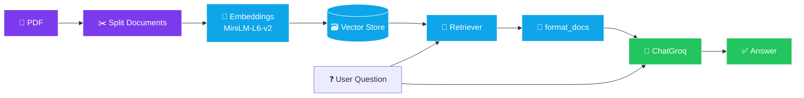
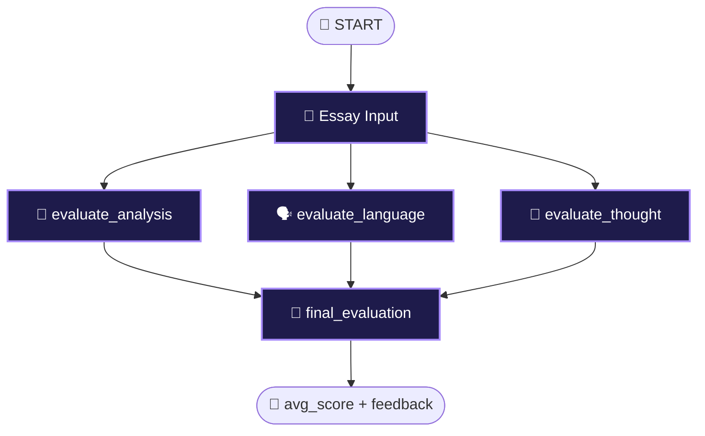

<div align="center">


<br/>

<a href="https://github.com/osamashabih6960/Langsmith-masterclass">
  
</a>

<br/><br/>


<br/>


<br/><br/>

<a href="https://drive.google.com/file/d/1NkzmKZzzrF8zQQ_dXDw2ch8E6R9skwNq/view?usp=sharing">
  
</a>
&nbsp;
<a href="#-quick-start">
  
</a>

</div>

<br/>

## 📑 Table of Contents

| | | |
|:--|:--|:--|
| [🌌 About](#-about) | [🎬 Demo](#-demo) | [🧩 What's Inside](#-whats-inside) |
| [🛠️ Tech Stack](#%EF%B8%8F-tech-stack) | [🏗️ Architecture](#%EF%B8%8F-architecture) | [🔍 Tracing](#-langsmith-tracing-in-action) |
| [⚡ Quick Start](#-quick-start) | [🧪 Example Output](#-example-output) | [🩺 Troubleshooting](#-troubleshooting) |
| [🗺️ Roadmap](#%EF%B8%8F-roadmap) | [🤝 Contributing](#-contributing) | [📚 Resources](#-resources) |

---

## 🌌 About

**LangSmith Masterclass** is a hands-on repository that shows how to *build, trace and evaluate* LLM-powered applications using **LangChain**, **LangGraph** and **LangSmith**.

Every example is a **real project**, and its full execution can be inspected step by step in the LangSmith dashboard: latency, tokens, inputs, outputs and errors.

> 💡 **Goal:** Turn your LLM app from a *black box* into a *glass box*.

<div align="center">

| 🔍 **Observe** | 🐞 **Debug** | 🧪 **Evaluate** | 🚀 **Ship** |
|:--:|:--:|:--:|:--:|
| A trace tree for every run | Spot slow or failing steps instantly | Structured scoring & feedback | Deploy with confidence |

</div>

<br/>

## 🎬 Demo

<div align="center">

<a href="https://drive.google.com/file/d/1NkzmKZzzrF8zQQ_dXDw2ch8E6R9skwNq/view?usp=sharing">
  
</a>

</div>

In the video you will see:

- 📂 The `langsmith-demo` project and all of its traces
- 🌲 Waterfall view: the parallel nodes inside `evaluate_upsc_essay`
- ⏱️ Latency, token counts and the Input / Output tabs
- 🏷️ Filtering runs with tags & metadata

> 📌 **Note (repo owner):** Set the Drive file to **"Anyone with the link → Viewer"**, otherwise visitors won't be able to watch the video.

<br/>

## 🧩 What's Inside

<table>
<tr>
<td width="50%" valign="top">

### 📄 Project 1 · PDF RAG Pipeline

Ask questions about a PDF (such as `islr.pdf`) and get context-grounded answers.

- 📥 PDF loading & chunking
- 🧬 `sentence-transformers/all-MiniLM-L6-v2`
- 🗃️ Vector store + retriever
- 🤖 Answer generation via **ChatGroq**
- 🏷️ Runs: `setup_pipeline` · `pdf_rag_query` · `pdf_rag_full_run`

</td>
<td width="50%" valign="top">

### ✍️ Project 2 · UPSC Essay Evaluator

A **LangGraph** multi-node evaluator that scores an essay from 3 angles in parallel.

- 🧠 `evaluate_analysis`
- 🗣️ `evaluate_language`
- 💭 `evaluate_thought`
- 🏁 `final_evaluation` → `avg_score` + feedback
- 🧾 Structured output via **Pydantic**

</td>
</tr>
<tr>
<td width="50%" valign="top">

### 🔗 Project 3 · Chains (`RunnableSequence`)

Prompt → LLM → Parser chains, fully traced.

- 📝 5-point summary chain
- ❓ Simple Q&A chain
- 📊 Latency & token comparison

</td>
<td width="50%" valign="top">

### 📡 Project 4 · Observability Toolkit

The core LangSmith features, learned in a practical way.

- 🔍 Tracing & run tree
- 🏷️ Tags & metadata
- ⏱️ Latency / cost monitoring
- 🧪 Datasets & evaluators *(roadmap)*

</td>
</tr>
</table>

<br/>

## 🛠️ Tech Stack

<div align="center">


<br/><br/>

| Layer | Tools |
|:-----:|:------|
| 🧠 **LLM** | `ChatGroq` · `openai/gpt-oss-20b` |
| 🔗 **Orchestration** | `LangChain` · `LangGraph` |
| 🔍 **Observability** | `LangSmith` |
| 🧬 **Embeddings** | `sentence-transformers/all-MiniLM-L6-v2` |
| 🧾 **Structured Output** | `Pydantic` · `PydanticToolsParser` |
| 🐍 **Language** | `Python 3.10+` |

</div>

<br/>

## 🏗️ Architecture

### 📄 PDF RAG Flow



### ✍️ UPSC Essay Evaluator (LangGraph)



> ⚡ All three evaluation nodes run **in parallel**, which keeps total latency low.

<br/>

## 🔍 LangSmith Tracing in Action

```text
📦 evaluate_upsc_essay
 ├── 🧠 evaluate_analysis
 │    ├── 🤖 ChatGroq (openai/gpt-oss-20b)
 │    └── 🧾 PydanticToolsParser
 ├── 🗣️ evaluate_language
 │    ├── 🤖 ChatGroq
 │    └── 🧾 PydanticToolsParser
 ├── 💭 evaluate_thought
 │    ├── 🤖 ChatGroq
 │    └── 🧾 PydanticToolsParser
 └── 🏁 final_evaluation
```

| What you can inspect | Where |
|:---------------------|:------|
| ⏱️ Latency of every step | Waterfall view |
| 🪙 Token usage | Run details |
| 📥📤 Inputs / Outputs | Input & Output tabs |
| 🏷️ Tags: `langgraph` `essay` `evaluation` `groq` `pdf` | Filter sidebar |
| ❌ Errors & failed runs | Status filter |

<!-- 📸 To add screenshots, upload them to an assets/ folder and uncomment:
<p align="center">
  
</p>
-->

<br/>

## ⚡ Quick Start

**1️⃣ Clone**

```bash
git clone https://github.com/osamashabih6960/Langsmith-masterclass.git
cd Langsmith-masterclass
```

**2️⃣ Create a virtual environment**

```bash
# macOS / Linux
python3 -m venv venv && source venv/bin/activate

# Windows
python -m venv venv && venv\Scripts\activate
```

**3️⃣ Install dependencies**

```bash
pip install -r requirements.txt
```

**4️⃣ Set environment variables** (create a `.env` file in the project root)

```env
LANGCHAIN_TRACING_V2=true
LANGCHAIN_API_KEY=your_langsmith_api_key
LANGCHAIN_PROJECT=langsmith-demo
GROQ_API_KEY=your_groq_api_key
```

> 🔑 LangSmith key: [smith.langchain.com](https://smith.langchain.com) → **Settings → API Keys**
> 🔑 Groq key: [console.groq.com](https://console.groq.com)

**5️⃣ Run & trace**

```bash
python your_script_name.py     # replace with your file name
```

Then open [smith.langchain.com](https://smith.langchain.com) → **Tracing → `langsmith-demo`**. 🎉

<br/>

## 📁 Project Structure

> ⚠️ This is a template. Edit it to match your actual folders and files.

```text
Langsmith-masterclass/
├── 📄 README.md
├── 📄 requirements.txt
├── 🔐 .env.example
├── 📂 pdf_rag/              # PDF RAG pipeline
├── 📂 essay_evaluator/      # LangGraph UPSC evaluator
├── 📂 chains/               # RunnableSequence examples
├── 📂 data/                 # PDFs (islr.pdf, ...)
└── 📂 assets/               # screenshots
```

<br/>

## 🧪 Example Output

<details>
<summary><b>✍️ UPSC Essay Evaluator: sample result</b></summary>

```json
{
  "analysis_feedback": "Broad overview of AI's impact across sectors...",
  "language_feedback": "Frequent grammatical errors, basic attempt only...",
  "clarity_feedback": "Vague phrasing reduces clarity...",
  "overall_feedback": "Clear intent, but needs depth and polish.",
  "individual_scores": [4, 4, 4],
  "avg_score": 4
}
```

</details>

<details>
<summary><b>📄 PDF RAG: sample query</b></summary>

```text
Q: What is linear regression?
A: Linear regression is a simple approach for predicting a quantitative response...
```

</details>

<br/>

## 🩺 Troubleshooting

<details>
<summary><b>Traces are not showing up in LangSmith</b></summary>

- Check that `.env` contains `LANGCHAIN_TRACING_V2=true` and a valid `LANGCHAIN_API_KEY`
- In the dashboard, keep the time filter on **Last 1 day** and select the right project (`langsmith-demo`)
- Make sure `load_dotenv()` is called at the very top of your script

</details>

<details>
<summary><b>RAG keeps answering "I don't know"</b></summary>

- The question must relate to the content of the PDF
- Try increasing `chunk_size`, `chunk_overlap` and the retriever's `k`
- Open the `VectorStoreRetriever` run in LangSmith to see which context was retrieved

</details>

<details>
<summary><b>The first run is very slow (1–2 minutes)</b></summary>

On the first run the embedding model is downloaded and the PDF is indexed. After that, queries are fast.

</details>

<br/>

## 🗺️ Roadmap

- [x] 📡 LangSmith tracing setup
- [x] 📄 PDF RAG pipeline
- [x] ✍️ LangGraph essay evaluator
- [ ] 🧪 Datasets & automated evaluators
- [ ] 💬 Feedback collection (👍 / 👎)
- [ ] 📈 Monitoring dashboards & alerts
- [ ] 🧰 Prompt Playground experiments
- [ ] 🌐 Streamlit / Gradio UI

<br/>

## 🤝 Contributing

Contributions are welcome! 🙌

```bash
git checkout -b feature/amazing-idea
git commit -m "✨ Add amazing idea"
git push origin feature/amazing-idea
# then open a Pull Request
```

<br/>

## 📚 Resources

- 📘 [LangSmith Docs](https://docs.langchain.com/langsmith/home)
- 🧱 [LangChain Docs](https://python.langchain.com)
- 🕸️ [LangGraph Docs](https://langchain-ai.github.io/langgraph/)
- ⚡ [Groq Console](https://console.groq.com)

<br/>

<div align="center">

### 👨‍💻 Author

<a href="https://github.com/osamashabih6960">
  
</a>

<br/><br/>

⭐ **If you like this repo, please give it a star!** ⭐

<br/>


</div>
